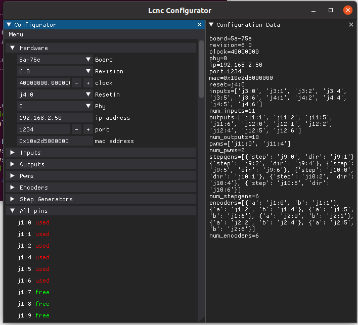
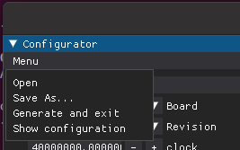

Lcnc is an fpga firmware to be used in LinuxCNC.

Lcnc is my own interpretation of colorcnc form 
Roman Pechenko <romanetz4@gmail.com> "romanetz"
https://forum.linuxcnc.org/27-driver-boards/44422-colorcnc

Lcnc consists of a FPGA configuration file, a Linuxcnc driver
and a set of tools for the creation of customizable FPGA configurations.

The FPGA can contain a set of several perpherals:
stepgenerators, general purpose in/out, encoder inputs, pwm.

The communication to the host (running Linuxcnc) is trough a gigabit ethernet link.

There are several ready FPGA configurations available, ready to be uploaded
on FPGA boards, also eventually new user defined configurations can be generated.

Up to 4 FPGA boards can be driven at the same time, using a gigabit ethernet switch.

The work now is focused on Colorligh 5a-75b and 5a-75e boards.
These boards have the pins configured as output-only, in order 
to have access to inputs some soldering is required.

The host side LinuxCNC driver will interface with FPGA firmware, 
on initial startup the driver will ask the board(s) their internal configuration
structure, and will self configure to provide pins and parameters that will 
enable the connection of the peripherals to LinuxCNC.

The protocol used to control the board is etherbone.
The firmware is written in migen, using Litex framework.

# Getting started with a prebuilt configuration firmware:
- you will need a colorlight 5a-75b or 75e board
- jtag adapter for loading and flashing bitfiles
- boards hw info and pin maps for jtag are available here https://github.com/q3k/chubby75
- Choose the firmware you want to try, the names reflect the peripherals available, for example 75b_v6_14o11i6s6e6p is built for a colorlight 5a75b V6.0 and will contain 14 outputs 11 inputs 6 stepgens 6 encoders interfaces and 6 pwm generators.
- Upload the firmware on the board, I'm using openFPGAloader but any such tool is good.
- Connect the board to the host pc and try to ping the board, the default ip address is 192.168.2.50, a Gigabit ethernet port is needed.
- If the board responds to pings then you can build the driver in LinuxCNC wih the command "sudo halcompile --install Lcnc.c" and start to work with the board.

# Communication and first enabling of the the board:
- ensure that the RESET pin on the board is grounded, you can find it's position on the 
  pinout document "Lcnc_configurations_pinout.ods", for example for 75b_v6_14o11i6s6e6p the RESET pin is J8 pin7

I have attached a very basic HAL configuration in the file HAL.hal for initial testing, the basic checks can be executed trough halshow interface. 

**Basic functionality check:**

- in the terminal start the HAL configuration: "halrun -I -V  HAL.hal"
- open a second terminal and start "halshow"
- Lcnc.00.update.time: this will show the update time for the component, in my system is around 200000ns
- Lcnc.00.watchdog-write: this is the board watchdog time, in seconds, I have it set to 0.01s (10ms) as default
- Lcnc.00.watchdog-read: this is the watchdog remaining time when petted, in seconds, check the value to be sure that is far from zero, and near to Lcnc.
- The above values should be updated continuosly if the board and driver are working correctly.
- set Lcnc.00.watchdog-write to 1
- Lcnc.00.enable to 1
- toggle Lcnc.00.enable-request from 0 to 1, then back to 0
- Lcnc.00.enabled should become 1, in this case the board is enabled and ready
- Lcnc.00.enable is the global enable flag for board, if set to true, the board can become ready to be enabled, the effective enabling will be requested by Lcnc.00.enable-request.
- Lcnc.00.enabled is the feedback confirmation that the board is enabled, as soon as Lcnc.00.enable will be set to false, the board will be disabled. The board can be disabed also if the onboard watchdog bites (to test this try to set Lcnc.00.watchdog-write to lower values until the board spontaneously disables). The board will disable also if it's hardware reset pin will be set to high (see "_ext_reset_in" in Lcnc.py for it's mapping).
- Set Lcnc.00.enable-request this interface is checked only on it's rising edge from False to True, then it is ignored, if there are no watchdog problems or hw reset request, the board will enable and set back Lcnc.00.enabled to True.

# Create your own configuration, what is needed:
- Litex installed and working, see https://github.com/enjoy-digital/litex
- oss-cad-suite: https://github.com/YosysHQ/oss-cad-suite-build 
- if you want to try the gui configurator install also dearpygui package: https://github.com/hoffstadt/DearPyGui
- clone Lcnc repo on your pc

There are three ways to edit the configuration to create your own:
- gui configurator
- edit coniguration .ini file
- edit configuration dictionary in Lcnc.py

# gui configurator utility
**experimental**
the GUI is invoked with the --gui option:
./Lcnc.py --gui

- you can load a configuration ini file with the menu "open" option
- you can edit the peripheral lists and pin assignments
- you can save the configuration in an ini file with the menu "save" option
- if you dont have an initial ini file the save option will create one from scratch
- once done the menu option "generate" will start the firmware generation

# editing the .ini configuration file
- the configuration is stored to and retrieved from an human readable and editable .ini file
- as stating point and initial template, a configuration file can be created from default configuration with the command ./Lcnc.py --saveconf=filename.ini
- this is useful also in case the configuration file is broken and you want to start from scratch
- filename.ini will be created with default configuration parameters
- you can edit this file and use it as starting point for your own configuration
- once edited you can build the configuration stored in the ini file with the command: ./Lcnc.py --loadconf=filename.ini --build

# editing the configuration dictionary in .py
- edit Lcnc.py modifying what is between  "Devices configuration start"  and  "Devices configuration end" in python file. This part of the firmware script file contains the list of the peripherals you want to include in the build, and the board pins assigned to each. The default driver contains a basic example with several inputs, outputs, pwm generators encoders, step generators.
- once edited the internal dictionary, if you want to change the board type, port, mac address ecc you need to use the command line options
- execute Lcnc.py:
  the command used to execute the firmware generation will accept arguments that will define
  the particular board to be used as target, and the ip address to assign to the board.
  the script can be run with default parameters, simply typing "./Lcnc.py --build --doc"
  this will generate a firmware for a colorlight 5A-75E V6.0 with ip=192.168.2.50 port=1234
- the target board can be changed adding to the command "board" and "revision" parameters, 
  for example "--board=5a-75b --revision=8.0"
- ip address can be configured with "--eth-ip" parameter, for example "--eth-ip=192.168.1.100"
- port can be changed with parameter "--eth-port" parameter, for example "--eth-port=1234"
- MAC address can be changed with parameter "--mac-address" parameter, for example "--mac-address=0x10e2d5000000"
- the script, if succesful, will generate many files, bitfile is located in /build/colorlight_5a_75e/gateware/Lcnc.bit
- upload the bitfile on the board
- connect the board, ping it to make sure that the the board is alive and connected

# Connecting to more than one board:
- up to 4 boards can be driven together, the only condition needed is to have unique ip, port and MAC for each board. A gigabit ethernet switch is needed.

# Pin numbering:
*pay attention to pin numbering of the board: in configuration files and GUI of Lcnc, the pin numbering will start from 0 and not from 1, so first pin of each header will be called "pin 0" and the last one will be "pin 15"*

# Why and how of PID in stepgen:
In Lcnc the stepgen is a variable frequency pulse generator, this is a choice for having simple fpga code and fast and smooth pulse generation dynamics.
Since the frequency (i.e pulses per second) is the joint velocity scaled by a constant quantity (constant that depend on steps per revolution, gear ratio, lead screw etc), Lcnc will have as input for the stepgen the requested joint velocity only.
Lcnc is not handling directly position request, and will provide only position feedback (by counting how many steps have been generated).
Usually we need to move the joint to a certain position, and linuxcnc will provide this as position command pin, so there is the need for something that will "translate" the position requested from linuxcnc to a velocity command to be sent to Lcnc. I'm using a PID component for this, since it is readly available in hal components, and it will be useful in case we want to move to a fully closed loop configuration with encoders. 
Pid sits in between linuxcnc and Lcnc, and will take as input the position command from linuxcnc and will provide on it's output the velocity command needed by Lcnc stepgen. Pid need also to know the actual position of the axis at every instant in order to provide correct calculations.
So to summarize Pid need two inputs: position you want to reach and actual joint position, and provides one output: requested joint velocity.
Here the feedback part could generate some confusion, also if in the configuration there is no real world feedback from the axis, a feedback from stepgen is needed anyway. The step generator in the fpga will take some time to move the axis, due to for example acceleration limit imposed in hal, or hardware limits in step rate, and since the acceleration is limited, and so the velocity, the actual position will change in a finite time, and the PID will need to be aware of this delays, so a position feedback is provided by Lcnc stepgen component, to be connected back to pid.
In the example configuration file all this can be seen in the lines:
- joint.1.motor-pos-cmd => pid.1.command # here the requested position from linuxcnc is connected to PID input command
- Lcnc.00.stepgen.01.pos-fb => pid.1.feedback # here the actual position feedback of the axis from Lcnc is connected to the PID feedback
- pid.1.output => Lcnc.00.stepgen.01.vel-cmd # here the pid output is connected to Lcnc velocity command input

Pid need some parameters to work correctly, and the values are usually chosen by some experiments and a certain knowledge is needed, but for the stepgen this part is very simple, since the feedback dynamics are predictable (because the feedback here is not from the real axis position*, but from stepgen calculations in fpga, so no disturbances from the real world), so simple parameters are suggested as the example in the hal file fo example above:
setp pid.1.FF1 1.0
setp pid.1.Pgain 200
setp pid.1.Igain 20
setp pid.1.Dgain 0
setp pid.1.deadband 0.01
If encoders are vailable, and the board is modified to read inputs, this configuration will easily be modified to accept feedback from encoders instead than from Lcnc by simply swapping Lcnc.00.stepgen.01.pos-fb with encoder feedback Lcnc.00.encoder.01.pos-fb, so the axis control will become full closed loop. 
In this case a proper PID calibration procedure for it's gains values is needed since the PID will be dealing with real world and unpredictable disturbances.

# Working with peripherals:
-- doc in construction, the peripherals are what they seem, play with them, only to be noted that stepgen is velocity mode only.

Digital inputs to the board, maximum number of 32 inputs per board can be defined:
- gpio in
  - linuxcnc -> driver
    - parameters: none
    - inputs: none
    - outputs:
      - Lcnc.xx.input.yy.in true if input driven high
      - Lcnc.xx.input.yy.in-n false if input driven high
  - driver -> etherbone registers: none
  - etherbone registers -> driver:
    - MMIO_INST_GPIOS_IN 32bit

Digital outputs from the board, maximum number of 32 outputs per board can be defined:
- gpio out
  - linuxcnc -> driver
    - parameters:
      - Lcnc.xx.output.yy.inv if true output is inverted
    - inputs:
      - Lcnc.xx.output.yy.out if true output is driven high or low depending on inversion parameter
    - outputs: none
  - driver -> registers:
    - MMIO_INST_GPIOS_OUT 32bit
  - registers -> driver: none

Encoder inputs, maximum 16 encoders per board can be defined:
- encoder inputs
  - linuxcnc -> driver
    - parameters:
      - Lcnc.xx.encoder.yy.scale scale to be applied to position read
      - Lcnc.xx.encoder.yy.inv count direction inversion
    - inputs:
      - Lcnc.xx.encoder.yy.reset reset position to zero
      - Lcnc.xx.encoder.yy.enable enable counting
    - outputs:
      - Lcnc.xx.encoder.yy.pos-fb position read, scaled
      - Lcnc.xx.encoder.yy.vel-fb velocity feedback, is difference in positions between two valld to driver, so can be imprecise at low speeds
  - driver -> registers:
    - MMIO_INST_ENC_RES_EN (16 bit enable e 16bit reset)
  - registers -> driver:
    - MMIO_INST_ENC_COUNT (32bit)

PWM outputs, simple pwm generators:
- pwm
  - linuxcnc -> driver
    - parameters:
      - Lcnc.xx.pwm.yy.scale full scale value
      - Lcnc.xx.pwm.yy.offs offset
      - Lcnc.xx.pwm.yy.inv inversion flag
    - inputs:
      - Lcnc.xx.pwm.yy.freq frequency in Hz, acceptable values are 612Hz to 2MHz at 40MHz FPGA internal clock, the higher frequency, the lower is the duty resolution
      - Lcnc.xx.pwm.yy.value value, from 0.0 to full scale value
      - Lcnc.xx.pwm.yy.enable ebable flag
    - outputs: none
  - driver -> registers:
    - MMIO_INST_PWM_0 (16bit period MSB,16bit width LSB)
  - registers -> driver: none

Step generator, maximum 16 instances possible per board, maximum steprate about half of FPGA internal clock (20MHz step rate at 40MHz clock, step width and step space set at 25ns).
The steprate is limited by minimum step space and step width, for example if step space and step width are set at 500ns the maximum step rate is 1MHz.
- step generator (sg)
  - linuxcnc -> driver
    - parameters:
      - Lcnc.xx.stepgen.yy.step_inv step inversion
      - Lcnc.xx.stepgen-step_width minimum step pulse width in ns, maximum 12775ns, resolution 25ns at 40MHz (parameter is applied to all stepgens)
      - Lcnc.xx.stepgen-step_space minimum interval between two steps pulses in ns,  maximum 12775ns, resolution 25ns at 40MHz (parameter is applied to all stepgens)
      - Lcnc.xx.stepgen.yy.dir_inv dir inversion
      - Lcnc.xx.stepgen-dir_width minimum dir pulse width in ns, maximum 12775ns, resolution 25ns at 40MHz (parameter is applied to all stepgens)
      - Lcnc.xx.stepgen-setup_time minimum interval between dir change and next step in ns, maximum 409575ns resolution 25ns at 40MHz (parameter is applied to all stepgens)
      - Lcnc.xx.stepgen.yy.scale scale in step/mm
    - inputs:
      - Lcnc.xx.stepgen.yy.reset reset internal state to default
      - Lcnc.xx.stepgen.yy.enable enables step generator
      - Lcnc.xx.stepgen.yy.vel-cmd velocity command in mm/s
      - Lcnc.xx.stepgen.yy.acc-lim acceleration limit in mm/s^2
    - outputs:
      - Lcnc.xx.stepgen.yy.vel-fb feedback velocity in mm/s
      - Lcnc.xx.stepgen.yy.pos-fb feedback position in mm
  - driver -> registers:
    - MMIO_INST_STEP_RES_EN (16 bit enable e 16bit reset)
    - MMIO_INST_STEPDIRINV (16 bit step inversion e 16bit dir inversion)
    - MMIO_INST_STEPTIMES (9bits step width 9bits dir width 14bits setup time)
    - MMIO_INST_STEPSIGN (16bit) velocity command sign
    - MMIO_INST_VELOCITY_n (32bit)
  - registers -> driver:
    - MMIO_INST_POSITION_n (32bit)

For internal use:

Watchdog, timer downcounting, when reaches zero the board is reset and peripherals are reset to default state, the driver reloads the counter value at each trasmission
- watchdog:
  - linuxcnc -> driver
    - outputs:
      - Lcnc.00.enabled if true the driver is working and enabled, goes to false in case of watchdog biting or externa hardware reset
    - inputs:
      - Lcnc.00.enable-request when goes from false to true, the driver is started
      - Lcnc.00.enable if true the enable request will be evaluated, if is false the driver is disabled
  - registers <-> driver:
    - MMIO_INST_RES_ST_REG (bits 10 to 32)

Wallclock: this is a clock running on fpga, and read from driver, used for time related internal calculations
- wallclock
  - linuxcnc -> driver
    - outputs:
      - Lcnc.xx.wallclock.yy.value u32 free running counter
      - Lcnc.xx.wallclock.yy.interval float last interval in seconds
  - registers -> driver:
    - MMIO_INST_WALLCLOCK 32bit

Enjoy

Fabio Eboli